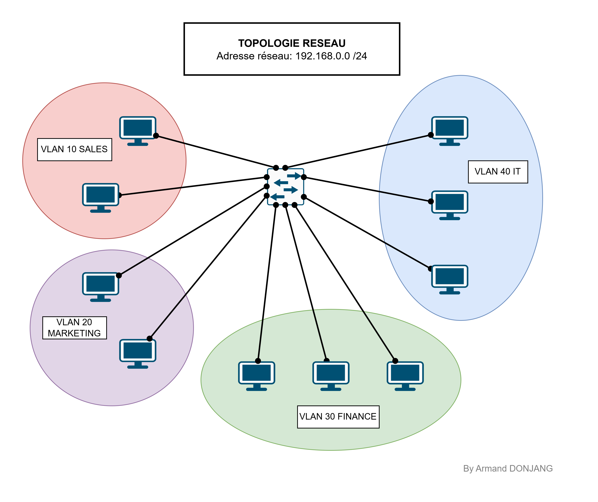
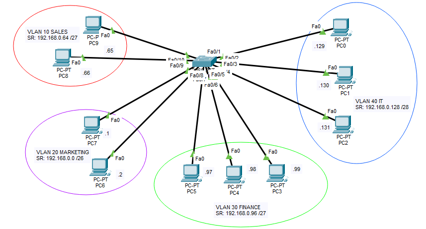
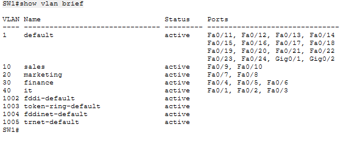

# MISE EN PRATIQUE DES VLANS

## Description

Ce projet est un laboratoire réalisé dans le cadre de ma préparation à la certification **Cisco CCNA 200-301**.

L'objectif est de mettre en pratique la création et la configuration de **Virtual Local Area Networks (VLANs)** afin de segmenter un réseau d'entreprise en plusieurs départements.

Les VLANs permettent d'améliorer :

- la sécurité
- les performances du réseau
- l'organisation des utilisateurs
- la réduction des domaines de broadcast

---

# Objectifs

- Concevoir une topologie réseau sous Cisco Packet Tracer.
- Créer plusieurs VLANs.
- Affecter les ports des switches aux VLANs correspondants.
- Vérifier la bonne configuration des VLANs.
- Comprendre la segmentation logique d'un réseau.

---

# Technologies utilisées

- Cisco Packet Tracer
- Cisco IOS
- VLAN

---

## Topologie



---

## Plan d’adressage

### Liste des VLANs

- **VLAN 10 Sales :** 30 équipements
- **VLAN 20 Marketing :** 42 équipements
- **VLAN 30 Finance :** 25 équipements
- **VLAN 40 IT :** 14 équipements

### Tableau des VLANs

| VLANs | Nombres d’hôtes | Adresses réseaux | Masques de sous-réseaux | Plages d’adresses | Passerelles |
|:-------:|:----------------:|:-----------------:|:-------------------------:|:-------------------:|:-------------:|
| VLAN 10 | 30 | 192.168.0.64 /27 | 255.255.255.224 | 192.168.0.65 - 192.168.0.95 | 192.168.0.94 |
| VLAN 20 | 42 | 192.168.0.0 /26 | 255.255.255.192 | 192.168.0.1 - 192.168.0.63 | 192.168.0.62 |
| VLAN 30 | 25 | 192.168.0.96 /27 | 255.255.255.224 | 192.168.0.97 - 192.168.0.127 | 192.168.0.126 |
| VLAN 40 | 14 | 192.168.0.128 /28 | 255.255.255.240 | 192.168.0.129 - 192.168.0.143 | 192.168.0.142 |

---

## Configuration des équipements

### Représentation de la topologie sur Packet Tracer



---

### Création des VLANs sur le Switch

```bash
SW1(config)#vlan 10
SW1(config-vlan)#name sales
SW1(config-vlan)#exit

SW1(config)#vlan 20
SW1(config-vlan)#name marketing
SW1(config-vlan)#exit

SW1(config)#vlan 30
SW1(config-vlan)#name finance
SW1(config-vlan)#exit

SW1(config)#vlan 40
SW1(config-vlan)#name it
SW1(config-vlan)#exit
```

---

### Assignation des VLANs à leurs ports respectifs

```bash
SW1(config)#interface range f0/1-3
SW1(config-if-range)#switchport mode access
SW1(config-if-range)#switchport access vlan 40
SW1(config-if-range)#exit

SW1(config)#interface range f0/4-6
SW1(config-if-range)#switchport mode access
SW1(config-if-range)#switchport access vlan 30
SW1(config-if-range)#exit

SW1(config)#interface range f0/7-8
SW1(config-if-range)#switchport mode access
SW1(config-if-range)#switchport access vlan 20
SW1(config-if-range)#exit

SW1(config)#interface range f0/9-10
SW1(config-if-range)#switchport mode access
SW1(config-if-range)#switchport access vlan 10
SW1(config-if-range)#exit
```

### Vérification des VLANs

```bash
SW1#show vlan brief
```

