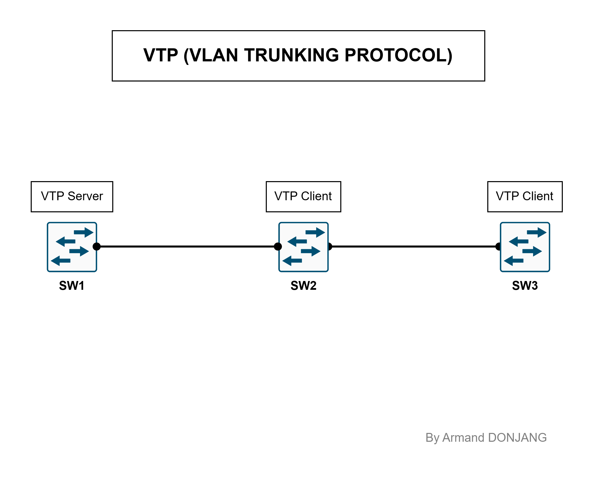
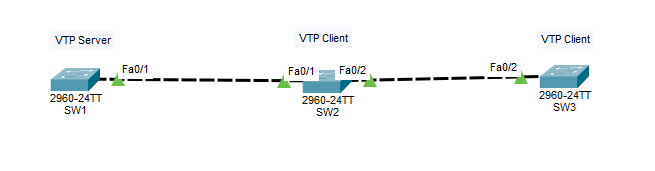
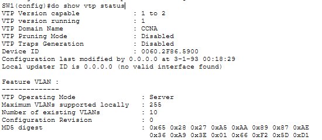
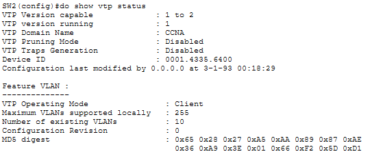
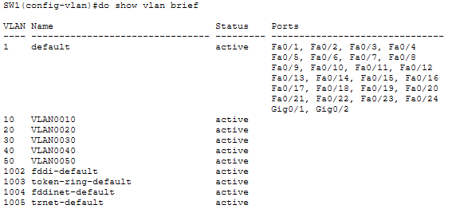
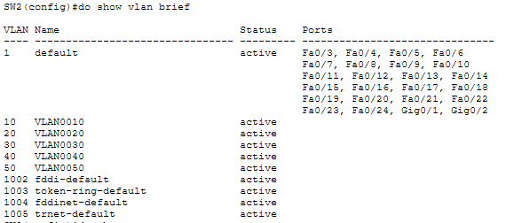
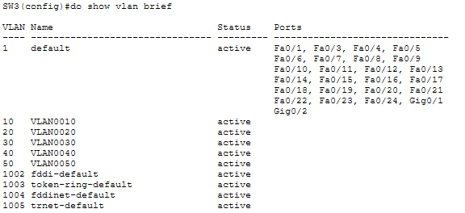
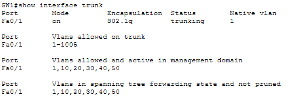
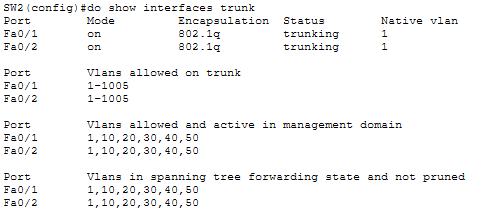

# MISE EN PRATIQUE DU VTP

## Topologie


## Description

Ce projet présente une implémentation complète du protocole VTP (VLAN Trunking Protocol) réalisée avec Cisco Packet Tracer.


## Objectifs
- Concevoir une topologie réseau sous Cisco Packet Tracer.
- Créer plusieurs VLANs (10, 20, 30, 40, 50).
- Réaliser des liens trunk entre plusieurs switches.
- Vérifier la bonne configuration des VLANs.
- Vérifier la bonne configuration des VTP.


## Compétences mises en œuvre

- VLAN
- VTP Server
- Trunk 802.1Q
- Cisco IOS
- Cisco Packet Tracer


## Configuration des équipements

### Représentation de la topologie sur Packet Tracer


### Création des VLANs sur SW1

```bash
SW1(config)# vlan 10
SW1(config-vlan)# exit

SW1(config)# vlan 20
SW1(config-vlan)# exit

SW1(config)# vlan 30
SW1(config-vlan)# exit

SW1(config)# vlan 40
SW1(config-vlan)# exit

SW1(config)# vlan 50
SW1(config-vlan)# exit
```

### Création des liaisons Trunk

```bash
SW1(config)# interface range f0/1
SW1(config-if-range)# switchport mode trunk

SW2(config)# interface range f0/1-2
SW2(config-if-range)# switchport mode trunk

SW3(config)# interface f0/2
SW3(config-if)# switchport mode trunk
```

### Configuration du VTP

```bash
SW1(config)# vtp mode server
SW1(config)# vtp domain CCNA
SW1(config)# vtp password ccn@123

SW2(config)# vtp mode server
SW2(config)# vtp domain CCNA
SW2(config)# vtp password ccn@123

SW3(config)# vtp mode server
SW3(config)# vtp domain CCNA
SW3(config)# vtp password ccn@123
```

---

## 4. Vérifications

### Vérification du VTP

```bash
show vtp status
```




### Vérification des VLANs

```bash
show vlan brief
```




### Vérification des liens Trunk

```bash
show interface trunk
```



